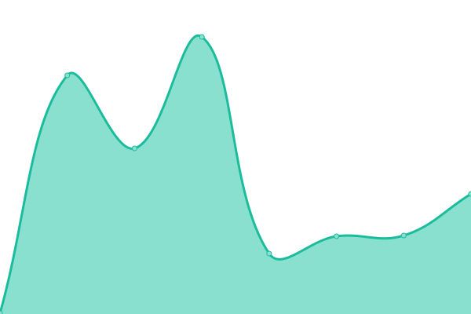

# [📈 Live Status](https://status.hacktivity.com): <!--live status--> **🟩 All systems operational**

This repository contains the open-source uptime monitor and status page for [hacktivityconf](https://status.hacktivity.com), powered by [Upptime](https://github.com/upptime/upptime).

With [Upptime](https://upptime.js.org), you can get your own unlimited and free uptime monitor and status page, powered entirely by a GitHub repository. We use [Issues](https://github.com/hacktivityconf/upptime/issues) as incident reports, [Actions](https://github.com/hacktivityconf/upptime/actions) as uptime monitors, and [Pages](https://status.hacktivity.com) for the status page.

<!--start: status pages-->
<!-- This summary is generated by Upptime (https://github.com/upptime/upptime) -->
<!-- Do not edit this manually, your changes will be overwritten -->
<!-- prettier-ignore -->
| URL | Status | History | Response Time | Uptime |
| --- | ------ | ------- | ------------- | ------ |
|  [Hacktivity - Website](https://hacktivity.com) | 🟩 Up | [hacktivity-website.yml](https://github.com/hacktivityconf/upptime/commits/HEAD/history/hacktivity-website.yml) | 

 2004ms
     
 | 

<a href="https://status.hacktivity.com/history/hacktivity-website">100.00%</a>
    

|  [Hacktivity - Tickets](https://tickets.hacktivity.com/en/) | 🟩 Up | [hacktivity-tickets.yml](https://github.com/hacktivityconf/upptime/commits/HEAD/history/hacktivity-tickets.yml) | 

 617ms
     
 | 

<a href="https://status.hacktivity.com/history/hacktivity-tickets">100.00%</a>
    

|  [Hacktivity - Tickets Email Server](195.228.75.155) | 🟩 Up | [hacktivity-tickets-email-server.yml](https://github.com/hacktivityconf/upptime/commits/HEAD/history/hacktivity-tickets-email-server.yml) | 

 138ms
     
 | 

<a href="https://status.hacktivity.com/history/hacktivity-tickets-email-server">100.00%</a>
    

|  [BSidesBud - CDN](https://cdn.bsidesbud.com/uploads/2017/01/small_logo_website.png) | 🟩 Up | [b-sides-bud-cdn.yml](https://github.com/hacktivityconf/upptime/commits/HEAD/history/b-sides-bud-cdn.yml) | 

 226ms
     
 | 

<a href="https://status.hacktivity.com/history/b-sides-bud-cdn">100.00%</a>
    

|  [BSidesBud - Website](https://bsidesbud.com/sitemap_index.xml) | 🟩 Up | [b-sides-bud-website.yml](https://github.com/hacktivityconf/upptime/commits/HEAD/history/b-sides-bud-website.yml) | 

 3749ms
     
 | 

<a href="https://status.hacktivity.com/history/b-sides-bud-website">98.95%</a>
    

|  [BSidesBud - Analytics](https://t.bsidesbud.com/api/health) | 🟩 Up | [b-sides-bud-analytics.yml](https://github.com/hacktivityconf/upptime/commits/HEAD/history/b-sides-bud-analytics.yml) | 

 262ms
     
 | 

<a href="https://status.hacktivity.com/history/b-sides-bud-analytics">98.94%</a>
    

|  BSidesBud - Server | 🟩 Up | [b-sides-bud-server.yml](https://github.com/hacktivityconf/upptime/commits/HEAD/history/b-sides-bud-server.yml) | 

 128ms
     
 | 

<a href="https://status.hacktivity.com/history/b-sides-bud-server">98.08%</a>
    

|  BSidesBud - Legacy Server | 🟩 Up | [b-sides-bud-legacy-server.yml](https://github.com/hacktivityconf/upptime/commits/HEAD/history/b-sides-bud-legacy-server.yml) | 

 119ms
     
 | 

<a href="https://status.hacktivity.com/history/b-sides-bud-legacy-server">100.00%</a>
    

<!--end: status pages-->

[**Visit our status website →**](https://status.hacktivity.com)

## 📄 License

- Powered by: [Upptime](https://github.com/upptime/upptime)
- Code: [MIT](./LICENSE) © [Anand Chowdhary](https://anandchowdhary.com), supported by [Pabio](https://pabio.com)
- Data in the `./history` directory: [Open Database License](https://opendatacommons.org/licenses/odbl/1-0/)
